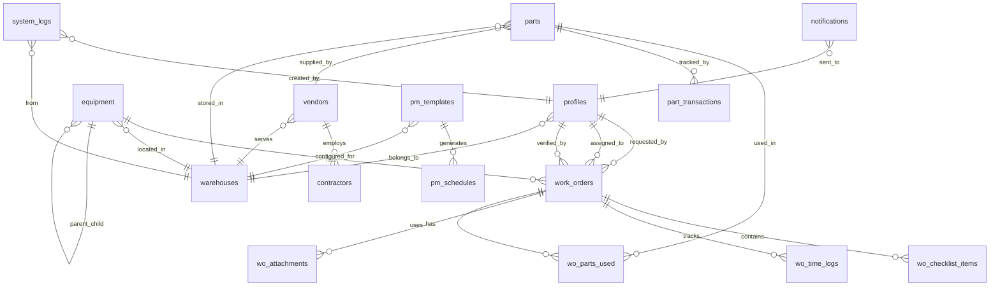

# Database Schema & Design

## 🗄️ Database Design Overview

### Design Principles

- **Normalization**: Third normal form (3NF) for data integrity
- **Performance**: Strategic denormalization for read-heavy operations
- **Scalability**: Horizontal partitioning for multi-warehouse data
- **Security**: Row-level security (RLS) for data isolation
- **Auditability**: Complete audit trail for all operations
- **Flexibility**: JSONB fields for custom data and extensibility

## 📊 Entity Relationship Diagram



## 🏗️ Core Tables

### Authentication & User Management

#### profiles

```sql
CREATE TABLE profiles (
    id UUID PRIMARY KEY REFERENCES auth.users(id) ON DELETE CASCADE,
    role user_role_enum NOT NULL DEFAULT 'technician',
    warehouse_id UUID NOT NULL REFERENCES warehouses(id),
    first_name TEXT NOT NULL,
    last_name TEXT NOT NULL,
    email TEXT UNIQUE NOT NULL,
    phone TEXT,
    skills TEXT[],
    certifications TEXT[],
    is_active BOOLEAN DEFAULT TRUE,
    created_at TIMESTAMP WITH TIME ZONE DEFAULT NOW(),
    updated_at TIMESTAMP WITH TIME ZONE DEFAULT NOW()
);

-- Indexes
CREATE INDEX idx_profiles_warehouse_id ON profiles(warehouse_id);
CREATE INDEX idx_profiles_role ON profiles(role);
CREATE INDEX idx_profiles_email ON profiles(email);
```

#### warehouses

```sql
CREATE TABLE warehouses (
    id UUID PRIMARY KEY DEFAULT gen_random_uuid(),
    name TEXT NOT NULL,
    code TEXT UNIQUE NOT NULL,
    address TEXT,
    city TEXT,
    state TEXT,
    zip_code TEXT,
    country TEXT DEFAULT 'USA',
    timezone TEXT DEFAULT 'UTC',
    operating_hours_start TIME,
    operating_hours_end TIME,
    emergency_contact TEXT,
    is_active BOOLEAN DEFAULT TRUE,
    created_at TIMESTAMP WITH TIME ZONE DEFAULT NOW(),
    updated_at TIMESTAMP WITH TIME ZONE DEFAULT NOW()
);

-- Indexes
CREATE INDEX idx_warehouses_code ON warehouses(code);
CREATE INDEX idx_warehouses_active ON warehouses(is_active);
```

### Equipment & Asset Management

#### equipment

```sql
CREATE TABLE equipment (
    id UUID PRIMARY KEY DEFAULT gen_random_uuid(),
    asset_tag TEXT UNIQUE NOT NULL,
    fo_number TEXT,
    model TEXT NOT NULL,
    manufacturer TEXT,
    serial_number TEXT,
    description TEXT,
    area TEXT,
    location TEXT,
    warehouse_id UUID NOT NULL REFERENCES warehouses(id),
    status equipment_status_enum DEFAULT 'active',
    criticality criticality_enum DEFAULT 'medium',
    installation_date DATE,
    warranty_expiry DATE,
    purchase_cost DECIMAL(10,2),
    replacement_cost DECIMAL(10,2),
    parent_equipment_id UUID REFERENCES equipment(id),
    hierarchy_level INTEGER DEFAULT 0,
    component_type TEXT,
    specifications JSONB,
    qr_code_url TEXT,
    is_active BOOLEAN DEFAULT TRUE,
    created_at TIMESTAMP WITH TIME ZONE DEFAULT NOW(),
    updated_at TIMESTAMP WITH TIME ZONE DEFAULT NOW(),
    created_by UUID REFERENCES profiles(id)
);

-- Indexes
CREATE INDEX idx_equipment_warehouse_id ON equipment(warehouse_id);
CREATE INDEX idx_equipment_asset_tag ON equipment(asset_tag);
CREATE INDEX idx_equipment_model ON equipment(model);
CREATE INDEX idx_equipment_status ON equipment(status);
CREATE INDEX idx_equipment_criticality ON equipment(criticality);
CREATE INDEX idx_equipment_parent_id ON equipment(parent_equipment_id);
CREATE INDEX idx_equipment_hierarchy_level ON equipment(hierarchy_level);
```

#### equipment_maintenance_history

```sql
CREATE TABLE equipment_maintenance_history (
    id UUID PRIMARY KEY DEFAULT gen_random_uuid(),
    equipment_id UUID NOT NULL REFERENCES equipment(id),
    work_order_id UUID REFERENCES work_orders(id),
    maintenance_type TEXT NOT NULL,
    description TEXT,
    technician_id UUID REFERENCES profiles(id),
    maintenance_date DATE NOT NULL,
    duration_hours DECIMAL(5,2),
    cost DECIMAL(10,2),
    notes TEXT,
    created_at TIMESTAMP WITH TIME ZONE DEFAULT NOW()
);

-- Indexes
CREATE INDEX idx_equipment_history_equipment_id ON equipment_maintenance_history(equipment_id);
CREATE INDEX idx_equipment_history_work_order_id ON equipment_maintenance_history(work_order_id);
CREATE INDEX idx_equipment_history_date ON equipment_maintenance_history(maintenance_date);
```

### Work Order Management

#### work_orders

```sql
CREATE TABLE work_orders (
    id UUID PRIMARY KEY DEFAULT gen_random_uuid(),
    fo_number TEXT UNIQUE NOT NULL,
    type wo_type_enum NOT NULL,
    title TEXT NOT NULL,
    description TEXT,
    area TEXT,
    asset_model TEXT,
    equipment_id UUID REFERENCES equipment(id),
    status wo_status_enum DEFAULT 'open',
    priority priority_enum DEFAULT 'medium',
    requested_by UUID NOT NULL REFERENCES profiles(id),
    assigned_to UUID[] DEFAULT '{}',
    created_at TIMESTAMP WITH TIME ZONE DEFAULT NOW(),
    due_date TIMESTAMP WITH TIME ZONE,
    started_at TIMESTAMP WITH TIME ZONE,
    completed_at TIMESTAMP WITH TIME ZONE,
    verified_by UUID REFERENCES profiles(id),
    verified_at TIMESTAMP WITH TIME ZONE,
    warehouse_id UUID NOT NULL REFERENCES warehouses(id),
    escalated BOOLEAN DEFAULT FALSE,
    escalation_level INTEGER DEFAULT 0,
    last_updated TIMESTAMP WITH TIME ZONE DEFAULT NOW(),
    follow_up BOOLEAN DEFAULT FALSE,
    estimated_hours DECIMAL(5,2),
    actual_hours DECIMAL(5,2),
    estimated_cost DECIMAL(10,2),
    actual_cost DECIMAL(10,2),
    custom_fields JSONB,
    is_active BOOLEAN DEFAULT TRUE
);

-- Indexes
CREATE INDEX idx_work_orders_warehouse_id ON work_orders(warehouse_id);
CREATE INDEX idx_work_orders_fo_number ON work_orders(fo_number);
CREATE INDEX idx_work_orders_status ON work_orders(status);
CREATE INDEX idx_work_orders_priority ON work_orders(priority);
CREATE INDEX idx_work_orders_type ON work_orders(type);
CREATE INDEX idx_work_orders_equipment_id ON work_orders(equipment_id);
CREATE INDEX idx_work_orders_requested_by ON work_orders(requested_by);
CREATE INDEX idx_work_orders_assigned_to ON work_orders USING GIN(assigned_to);
CREATE INDEX idx_work_orders_due_date ON work_orders(due_date);
CREATE INDEX idx_work_orders_escalated ON work_orders(escalated);
```

#### wo_checklist_items

```sql
CREATE TABLE wo_checklist_items (
    id UUID PRIMARY KEY DEFAULT gen_random_uuid(),
    work_order_id UUID NOT NULL REFERENCES work_orders(id) ON DELETE CASCADE,
    sequence_number INTEGER NOT NULL,
    component TEXT NOT NULL,
    action TEXT NOT NULL,
    description TEXT,
    instructions TEXT,
    is_mandatory BOOLEAN DEFAULT FALSE,
    status checklist_status_enum DEFAULT 'pending',
    notes TEXT,
    custom_field_data JSONB,
    created_at TIMESTAMP WITH TIME ZONE DEFAULT NOW(),
    completed_at TIMESTAMP WITH TIME ZONE,
    completed_by UUID REFERENCES profiles(id),
    estimated_minutes INTEGER,
    actual_minutes INTEGER
);

-- Indexes
CREATE INDEX idx_wo_checklist_work_order_id ON wo_checklist_items(work_order_id);
CREATE INDEX idx_wo_checklist_status ON wo_checklist_items(status);
CREATE INDEX idx_wo_checklist_sequence ON wo_checklist_items(work_order_id, sequence_number);
```

#### wo_time_logs

```sql
CREATE TABLE wo_time_logs (
    id UUID PRIMARY KEY DEFAULT gen_random_uuid(),
    work_order_id UUID NOT NULL REFERENCES work_orders(id) ON DELETE CASCADE,
    user_id UUID NOT NULL REFERENCES profiles(id),
    start_time TIMESTAMP WITH TIME ZONE NOT NULL,
    end_time TIMESTAMP WITH TIME ZONE,
    duration_minutes INTEGER,
    description TEXT,
    activity_type TEXT DEFAULT 'work',
    created_at TIMESTAMP WITH TIME ZONE DEFAULT NOW()
);

-- Indexes
CREATE INDEX idx_wo_time_logs_work_order_id ON wo_time_logs(work_order_id);
CREATE INDEX idx_wo_time_logs_user_id ON wo_time_logs(user_id);
CREATE INDEX idx_wo_time_logs_start_time ON wo_time_logs(start_time);
```

#### wo_attachments

```sql
CREATE TABLE wo_attachments (
    id UUID PRIMARY KEY DEFAULT gen_random_uuid(),
    work_order_id UUID NOT NULL REFERENCES work_orders(id) ON DELETE CASCADE,
    checklist_item_id UUID REFERENCES wo_checklist_items(id),
    file_name TEXT NOT NULL,
    file_url TEXT NOT NULL,
    file_type TEXT NOT NULL,
    file_size INTEGER NOT NULL,
    mime_type TEXT,
    description TEXT,
    uploaded_by UUID NOT NULL REFERENCES profiles(id),
    created_at TIMESTAMP WITH TIME ZONE DEFAULT NOW()
);

-- Indexes
CREATE INDEX idx_wo_attachments_work_order_id ON wo_attachments(work_order_id);
CREATE INDEX idx_wo_attachments_checklist_item_id ON wo_attachments(checklist_item_id);
CREATE INDEX idx_wo_attachments_uploaded_by ON wo_attachments(uploaded_by);
```

### Parts & Inventory Management

#### parts

```sql
CREATE TABLE parts (
    id UUID PRIMARY KEY DEFAULT gen_random_uuid(),
    part_number TEXT UNIQUE NOT NULL,
    original_number TEXT,
    description TEXT NOT NULL,
    manufacturer TEXT,
    manufacturer_part_number TEXT,
    category TEXT,
    unit_of_measure TEXT DEFAULT 'each',
    unit_cost DECIMAL(10,2),
    quantity_on_hand INTEGER DEFAULT 0,
    reserved_quantity INTEGER DEFAULT 0,
    available_quantity INTEGER GENERATED ALWAYS AS (quantity_on_hand - reserved_quantity) STORED,
    reorder_point INTEGER DEFAULT 0,
    reorder_quantity INTEGER DEFAULT 0,
    max_stock_level INTEGER,
    model_compatibility TEXT[],
    default_bin TEXT,
    warehouse_id UUID NOT NULL REFERENCES warehouses(id),
    vendor_id UUID REFERENCES vendors(id),
    is_active BOOLEAN DEFAULT TRUE,
    created_at TIMESTAMP WITH TIME ZONE DEFAULT NOW(),
    updated_at TIMESTAMP WITH TIME ZONE DEFAULT NOW()
);

-- Indexes
CREATE INDEX idx_parts_warehouse_id ON parts(warehouse_id);
CREATE INDEX idx_parts_part_number ON parts(part_number);
CREATE INDEX idx_parts_vendor_id ON parts(vendor_id);
CREATE INDEX idx_parts_category ON parts(category);
CREATE INDEX idx_parts_low_stock ON parts(warehouse_id, available_quantity, reorder_point) WHERE available_quantity <= reorder_point;
CREATE INDEX idx_parts_model_compatibility ON parts USING GIN(model_compatibility);
```

#### part_transactions

```sql
CREATE TABLE part_transactions (
    id UUID PRIMARY KEY DEFAULT gen_random_uuid(),
    part_id UUID NOT NULL REFERENCES parts(id),
    work_order_id UUID REFERENCES work_orders(id),
    transaction_type transaction_type_enum NOT NULL,
    quantity INTEGER NOT NULL,
    unit_cost DECIMAL(10,2),
    total_cost DECIMAL(10,2),
    reference_number TEXT,
    notes TEXT,
    performed_by UUID NOT NULL REFERENCES profiles(id),
    created_at TIMESTAMP WITH TIME ZONE DEFAULT NOW()
);

-- Indexes
CREATE INDEX idx_part_transactions_part_id ON part_transactions(part_id);
CREATE INDEX idx_part_transactions_work_order_id ON part_transactions(work_order_id);
CREATE INDEX idx_part_transactions_type ON part_transactions(transaction_type);
CREATE INDEX idx_part_transactions_date ON part_transactions(created_at);
```

#### wo_parts_used

```sql
CREATE TABLE wo_parts_used (
    id UUID PRIMARY KEY DEFAULT gen_random_uuid(),
    work_order_id UUID NOT NULL REFERENCES work_orders(id) ON DELETE CASCADE,
    part_id UUID NOT NULL REFERENCES parts(id),
    quantity_used INTEGER NOT NULL,
    unit_cost DECIMAL(10,2),
    total_cost DECIMAL(10,2),
    used_by UUID NOT NULL REFERENCES profiles(id),
    used_at TIMESTAMP WITH TIME ZONE DEFAULT NOW(),
    notes TEXT
);

-- Indexes
CREATE INDEX idx_wo_parts_used_work_order_id ON wo_parts_used(work_order_id);
CREATE INDEX idx_wo_parts_used_part_id ON wo_parts_used(part_id);
CREATE INDEX idx_wo_parts_used_date ON wo_parts_used(used_at);
```

### Preventive Maintenance

#### pm_templates

```sql
CREATE TABLE pm_templates (
    id UUID PRIMARY KEY DEFAULT gen_random_uuid(),
    name TEXT NOT NULL,
    model TEXT NOT NULL,
    component TEXT,
    frequency frequency_enum NOT NULL,
    interval_value INTEGER NOT NULL,
    interval_unit interval_unit_enum NOT NULL,
    description TEXT,
    instructions TEXT,
    estimated_duration_hours DECIMAL(5,2),
    required_skills TEXT[],
    required_tools TEXT[],
    safety_notes TEXT,
    custom_fields JSONB,
    warehouse_id UUID NOT NULL REFERENCES warehouses(id),
    is_active BOOLEAN DEFAULT TRUE,
    created_at TIMESTAMP WITH TIME ZONE DEFAULT NOW(),
    updated_at TIMESTAMP WITH TIME ZONE DEFAULT NOW(),
    created_by UUID REFERENCES profiles(id)
);

-- Indexes
CREATE INDEX idx_pm_templates_warehouse_id ON pm_templates(warehouse_id);
CREATE INDEX idx_pm_templates_model ON pm_templates(model);
CREATE INDEX idx_pm_templates_frequency ON pm_templates(frequency);
CREATE INDEX idx_pm_templates_active ON pm_templates(is_active);
```

#### pm_template_checklist

```sql
CREATE TABLE pm_template_checklist (
    id UUID PRIMARY KEY DEFAULT gen_random_uuid(),
    template_id UUID NOT NULL REFERENCES pm_templates(id) ON DELETE CASCADE,
    sequence_number INTEGER NOT NULL,
    component TEXT NOT NULL,
    action TEXT NOT NULL,
    description TEXT,
    instructions TEXT,
    is_mandatory BOOLEAN DEFAULT FALSE,
    custom_field_type TEXT,
    custom_field_options JSONB,
    estimated_minutes INTEGER,
    created_at TIMESTAMP WITH TIME ZONE DEFAULT NOW()
);

-- Indexes
CREATE INDEX idx_pm_template_checklist_template_id ON pm_template_checklist(template_id);
CREATE INDEX idx_pm_template_checklist_sequence ON pm_template_checklist(template_id, sequence_number);
```

#### pm_schedules

```sql
CREATE TABLE pm_schedules (
    id UUID PRIMARY KEY DEFAULT gen_random_uuid(),
    equipment_id UUID NOT NULL REFERENCES equipment(id),
    template_id UUID NOT NULL REFERENCES pm_templates(id),
    next_due_date DATE NOT NULL,
    last_completed_date DATE,
    last_work_order_id UUID REFERENCES work_orders(id),
    is_active BOOLEAN DEFAULT TRUE,
    created_at TIMESTAMP WITH TIME ZONE DEFAULT NOW(),
    updated_at TIMESTAMP WITH TIME ZONE DEFAULT NOW()
);

-- Indexes
CREATE INDEX idx_pm_schedules_equipment_id ON pm_schedules(equipment_id);
CREATE INDEX idx_pm_schedules_template_id ON pm_schedules(template_id);
CREATE INDEX idx_pm_schedules_next_due_date ON pm_schedules(next_due_date);
CREATE INDEX idx_pm_schedules_active ON pm_schedules(is_active);
```

### Vendor & Contractor Management

#### vendors

```sql
CREATE TABLE vendors (
    id UUID PRIMARY KEY DEFAULT gen_random_uuid(),
    name TEXT NOT NULL,
    type vendor_type_enum NOT NULL,
    email TEXT,
    phone TEXT,
    address TEXT,
    city TEXT,
    state TEXT,
    zip_code TEXT,
    country TEXT DEFAULT 'USA',
    website TEXT,
    contact_person TEXT,
    payment_terms TEXT,
    tax_id TEXT,
    rating INTEGER CHECK (rating >= 1 AND rating <= 5),
    notes TEXT,
    warehouse_id UUID NOT NULL REFERENCES warehouses(id),
    is_active BOOLEAN DEFAULT TRUE,
    created_at TIMESTAMP WITH TIME ZONE DEFAULT NOW(),
    updated_at TIMESTAMP WITH TIME ZONE DEFAULT NOW()
);

-- Indexes
CREATE INDEX idx_vendors_warehouse_id ON vendors(warehouse_id);
CREATE INDEX idx_vendors_type ON vendors(type);
CREATE INDEX idx_vendors_name ON vendors(name);
CREATE INDEX idx_vendors_active ON vendors(is_active);
```

#### contractors

```sql
CREATE TABLE contractors (
    id UUID PRIMARY KEY DEFAULT gen_random_uuid(),
    vendor_id UUID NOT NULL REFERENCES vendors(id),
    name TEXT NOT NULL,
    email TEXT,
    phone TEXT,
    certifications TEXT[],
    skills TEXT[],
    hourly_rate DECIMAL(10,2),
    work_authorization_url TEXT,
    insurance_expiry DATE,
    safety_training_date DATE,
    is_available BOOLEAN DEFAULT TRUE,
    is_active BOOLEAN DEFAULT TRUE,
    created_at TIMESTAMP WITH TIME ZONE DEFAULT NOW(),
    updated_at TIMESTAMP WITH TIME ZONE DEFAULT NOW()
);

-- Indexes
CREATE INDEX idx_contractors_vendor_id ON contractors(vendor_id);
CREATE INDEX idx_contractors_available ON contractors(is_available);
CREATE INDEX idx_contractors_active ON contractors(is_active);
CREATE INDEX idx_contractors_skills ON contractors USING GIN(skills);
```

### System Configuration & Management

#### system_settings

```sql
CREATE TABLE system_settings (
    key TEXT PRIMARY KEY,
    value JSONB NOT NULL,
    description TEXT,
    category TEXT,
    editable_by_role TEXT[],
    created_at TIMESTAMP WITH TIME ZONE DEFAULT NOW(),
    updated_at TIMESTAMP WITH TIME ZONE DEFAULT NOW(),
    updated_by UUID REFERENCES profiles(id)
);

-- Indexes
CREATE INDEX idx_system_settings_category ON system_settings(category);
CREATE INDEX idx_system_settings_editable_by_role ON system_settings USING GIN(editable_by_role);
```

#### escalation_rules

```sql
CREATE TABLE escalation_rules (
    id UUID PRIMARY KEY DEFAULT gen_random_uuid(),
    name TEXT NOT NULL,
    wo_type wo_type_enum,
    priority priority_enum,
    timeout_hours INTEGER NOT NULL,
    escalation_action escalation_action_enum NOT NULL,
    escalation_target_role TEXT,
    escalation_target_user UUID REFERENCES profiles(id),
    warehouse_id UUID REFERENCES warehouses(id),
    is_active BOOLEAN DEFAULT TRUE,
    created_at TIMESTAMP WITH TIME ZONE DEFAULT NOW(),
    updated_at TIMESTAMP WITH TIME ZONE DEFAULT NOW()
);

-- Indexes
CREATE INDEX idx_escalation_rules_warehouse_id ON escalation_rules(warehouse_id);
CREATE INDEX idx_escalation_rules_wo_type ON escalation_rules(wo_type);
CREATE INDEX idx_escalation_rules_priority ON escalation_rules(priority);
CREATE INDEX idx_escalation_rules_active ON escalation_rules(is_active);
```

### Notifications & Communication

#### notifications

```sql
CREATE TABLE notifications (
    id UUID PRIMARY KEY DEFAULT gen_random_uuid(),
    user_id UUID NOT NULL REFERENCES profiles(id),
    type notification_type_enum NOT NULL,
    title TEXT NOT NULL,
    message TEXT NOT NULL,
    is_read BOOLEAN DEFAULT FALSE,
    work_order_id UUID REFERENCES work_orders(id),
    equipment_id UUID REFERENCES equipment(id),
    part_id UUID REFERENCES parts(id),
    created_at TIMESTAMP WITH TIME ZONE DEFAULT NOW(),
    read_at TIMESTAMP WITH TIME ZONE
);

-- Indexes
CREATE INDEX idx_notifications_user_id ON notifications(user_id);
CREATE INDEX idx_notifications_type ON notifications(type);
CREATE INDEX idx_notifications_read ON notifications(is_read);
CREATE INDEX idx_notifications_created_at ON notifications(created_at);
```

#### notification_settings

```sql
CREATE TABLE notification_settings (
    id UUID PRIMARY KEY DEFAULT gen_random_uuid(),
    user_id UUID NOT NULL REFERENCES profiles(id),
    notification_type TEXT NOT NULL,
    email_enabled BOOLEAN DEFAULT TRUE,
    push_enabled BOOLEAN DEFAULT TRUE,
    sms_enabled BOOLEAN DEFAULT FALSE,
    quiet_hours_start TIME,
    quiet_hours_end TIME,
    created_at TIMESTAMP WITH TIME ZONE DEFAULT NOW(),
    updated_at TIMESTAMP WITH TIME ZONE DEFAULT NOW(),
    UNIQUE(user_id, notification_type)
);

-- Indexes
CREATE INDEX idx_notification_settings_user_id ON notification_settings(user_id);
CREATE INDEX idx_notification_settings_type ON notification_settings(notification_type);
```

### Audit & Logging

#### system_logs

```sql
CREATE TABLE system_logs (
    id UUID PRIMARY KEY DEFAULT gen_random_uuid(),
    action TEXT NOT NULL,
    table_name TEXT NOT NULL,
    record_id UUID,
    user_id UUID REFERENCES profiles(id),
    ip_address INET,
    user_agent TEXT,
    old_values JSONB,
    new_values JSONB,
    description TEXT,
    warehouse_id UUID REFERENCES warehouses(id),
    created_at TIMESTAMP WITH TIME ZONE DEFAULT NOW()
);

-- Indexes
CREATE INDEX idx_system_logs_table_name ON system_logs(table_name);
CREATE INDEX idx_system_logs_record_id ON system_logs(record_id);
CREATE INDEX idx_system_logs_user_id ON system_logs(user_id);
CREATE INDEX idx_system_logs_warehouse_id ON system_logs(warehouse_id);
CREATE INDEX idx_system_logs_created_at ON system_logs(created_at);
```

## 🔐 Row Level Security (RLS) Policies

### Warehouse-Based Data Isolation

```sql
-- Enable RLS on all tables
ALTER TABLE equipment ENABLE ROW LEVEL SECURITY;
ALTER TABLE work_orders ENABLE ROW LEVEL SECURITY;
ALTER TABLE parts ENABLE ROW LEVEL SECURITY;
ALTER TABLE profiles ENABLE ROW LEVEL SECURITY;

-- Equipment RLS Policy
CREATE POLICY "Equipment access by warehouse"
  ON equipment
  FOR ALL
  TO authenticated
  USING (
    warehouse_id = (
      SELECT warehouse_id
      FROM profiles
      WHERE id = auth.uid()
    )
  );

-- Work Orders RLS Policy
CREATE POLICY "Work orders access by warehouse and role"
  ON work_orders
  FOR ALL
  TO authenticated
  USING (
    warehouse_id = (
      SELECT warehouse_id
      FROM profiles
      WHERE id = auth.uid()
    )
    AND (
      (SELECT role FROM profiles WHERE id = auth.uid()) IN ('admin', 'manager', 'supervisor')
      OR auth.uid() = requested_by
      OR auth.uid() = ANY(assigned_to)
    )
  );

-- Parts RLS Policy
CREATE POLICY "Parts access by warehouse"
  ON parts
  FOR ALL
  TO authenticated
  USING (
    warehouse_id = (
      SELECT warehouse_id
      FROM profiles
      WHERE id = auth.uid()
    )
  );
```

## 🔍 Performance Optimizations

### Indexing Strategy

- **Primary Keys**: UUID with btree indexes
- **Foreign Keys**: All foreign key columns indexed
- **Search Columns**: Text search columns with GIN indexes
- **Array Columns**: Skills, certifications, assigned_to with GIN indexes
- **Composite Indexes**: Multi-column indexes for common queries
- **Partial Indexes**: Conditional indexes for active records

### Query Optimization

```sql
-- Materialized view for dashboard metrics
CREATE MATERIALIZED VIEW dashboard_metrics AS
SELECT
    w.warehouse_id,
    COUNT(*) FILTER (WHERE wo.status = 'open') as open_work_orders,
    COUNT(*) FILTER (WHERE wo.status = 'in_progress') as in_progress_work_orders,
    COUNT(*) FILTER (WHERE wo.status = 'completed') as completed_work_orders,
    COUNT(*) FILTER (WHERE wo.escalated = true) as escalated_work_orders,
    COUNT(*) FILTER (WHERE p.available_quantity <= p.reorder_point) as low_stock_parts,
    AVG(EXTRACT(EPOCH FROM (wo.completed_at - wo.created_at))/3600) as avg_completion_hours
FROM warehouses w
LEFT JOIN work_orders wo ON w.id = wo.warehouse_id
LEFT JOIN parts p ON w.id = p.warehouse_id
GROUP BY w.id, w.warehouse_id;

-- Refresh materialized view periodically
CREATE OR REPLACE FUNCTION refresh_dashboard_metrics()
RETURNS void AS $$
BEGIN
    REFRESH MATERIALIZED VIEW dashboard_metrics;
END;
$$ LANGUAGE plpgsql;
```

## 🚀 Database Functions & Triggers

### Audit Trail Trigger

```sql
CREATE OR REPLACE FUNCTION audit_trigger_function()
RETURNS TRIGGER AS $$
BEGIN
    IF TG_OP = 'DELETE' THEN
        INSERT INTO system_logs (action, table_name, record_id, user_id, old_values, warehouse_id)
        VALUES ('DELETE', TG_TABLE_NAME, OLD.id, auth.uid(), row_to_json(OLD), OLD.warehouse_id);
        RETURN OLD;
    ELSIF TG_OP = 'UPDATE' THEN
        INSERT INTO system_logs (action, table_name, record_id, user_id, old_values, new_values, warehouse_id)
        VALUES ('UPDATE', TG_TABLE_NAME, NEW.id, auth.uid(), row_to_json(OLD), row_to_json(NEW), NEW.warehouse_id);
        RETURN NEW;
    ELSIF TG_OP = 'INSERT' THEN
        INSERT INTO system_logs (action, table_name, record_id, user_id, new_values, warehouse_id)
        VALUES ('INSERT', TG_TABLE_NAME, NEW.id, auth.uid(), row_to_json(NEW), NEW.warehouse_id);
        RETURN NEW;
    END IF;
    RETURN NULL;
END;
$$ LANGUAGE plpgsql;

-- Apply audit trigger to all relevant tables
CREATE TRIGGER audit_work_orders
    AFTER INSERT OR UPDATE OR DELETE ON work_orders
    FOR EACH ROW EXECUTE FUNCTION audit_trigger_function();
```

### Auto-Generate Work Order Numbers

```sql
CREATE OR REPLACE FUNCTION generate_wo_number()
RETURNS TRIGGER AS $$
BEGIN
    IF NEW.fo_number IS NULL THEN
        NEW.fo_number := 'WO-' || TO_CHAR(NOW(), 'YYYYMMDD') || '-' ||
                        LPAD(NEXTVAL('wo_sequence'), 4, '0');
    END IF;
    RETURN NEW;
END;
$$ LANGUAGE plpgsql;

CREATE TRIGGER generate_wo_number_trigger
    BEFORE INSERT ON work_orders
    FOR EACH ROW EXECUTE FUNCTION generate_wo_number();
```

This comprehensive database schema provides a robust foundation for the MaintAInPro CMMS system,
ensuring data integrity, security, and performance while supporting all the features outlined in the
blueprint.
