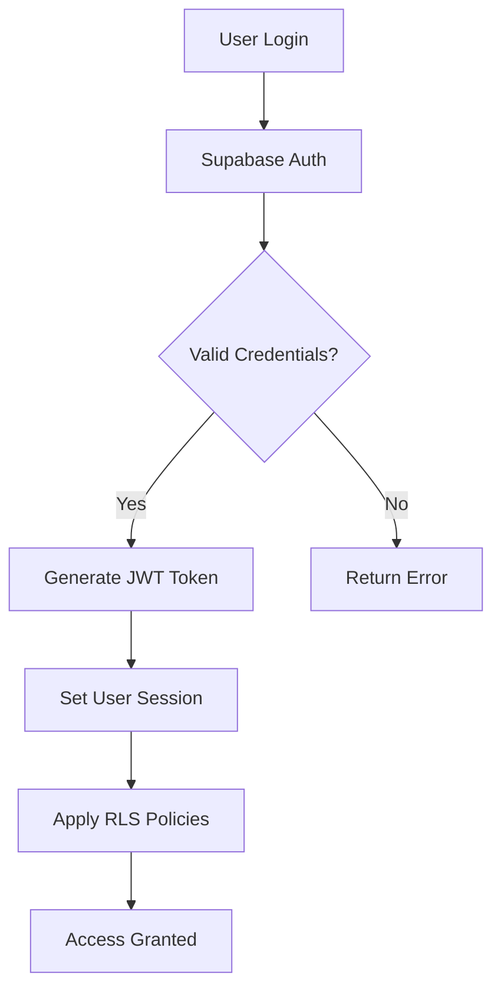

# System Architecture - Technical Blueprint

## 🏗️ Architecture Overview

### Architectural Principles

- **Domain-Driven Design (DDD)**: Organize code by business domains, not technical layers
- **CQRS Pattern**: Separate read/write operations for optimal performance
- **Event Sourcing**: Track all state changes for audit and debugging
- **Hexagonal Architecture**: Decouple business logic from external dependencies
- **Micro-frontends**: Modular, independently deployable UI components
- **API-First Design**: Design APIs before implementing features
- **Twelve-Factor App**: Cloud-native application principles
- **Progressive Enhancement**: Mobile-first with graceful degradation

## 🎨 Frontend Architecture

### Core Technology Stack

- **React 18+** with TypeScript (Strict mode enabled)
- **Vite 5+** for lightning-fast development and optimized builds
- **Tailwind CSS 3+** with custom design system and component tokens
- **Headless UI** for accessible, unstyled components
- **Framer Motion** for smooth animations and micro-interactions
- **React Query v4** (TanStack Query) for state management and caching
- **React Hook Form** with Zod validation for type-safe forms
- **React Router 6** with lazy loading and code splitting
- **React Testing Library** for component testing
- **Storybook 7** for component development and documentation

### Advanced Frontend Tools

- **MSW (Mock Service Worker)** for API mocking during development
- **Chromatic** for visual regression testing
- **React DevTools Profiler** for performance optimization
- **Bundle Analyzer** for optimizing bundle sizes
- **Lighthouse CI** for automated performance auditing
- **Axe-core** for accessibility testing automation
- **React Error Boundary** for graceful error handling
- **React Suspense** for progressive loading states

### Frontend Architecture Patterns

#### Component Architecture

```
src/
├── components/
│   ├── ui/                    # Reusable UI components
│   │   ├── Button/
│   │   ├── Input/
│   │   ├── Modal/
│   │   └── DataTable/
│   ├── forms/                 # Form components
│   │   ├── WorkOrderForm/
│   │   ├── EquipmentForm/
│   │   └── UserForm/
│   ├── layout/                # Layout components
│   │   ├── Header/
│   │   ├── Sidebar/
│   │   └── Footer/
│   └── charts/                # Chart components
│       ├── LineChart/
│       ├── BarChart/
│       └── PieChart/
├── modules/                   # Feature-based modules
│   ├── auth/
│   ├── work-orders/
│   ├── equipment/
│   ├── inventory/
│   ├── preventive-maintenance/
│   ├── reports/
│   ├── vendors/
│   └── settings/
├── hooks/                     # Custom hooks
├── services/                  # API services
├── utils/                     # Utility functions
├── types/                     # TypeScript types
└── constants/                 # Application constants
```

#### State Management Architecture

```typescript
// React Query for server state
const useWorkOrders = () => {
  return useQuery({
    queryKey: ['work-orders'],
    queryFn: fetchWorkOrders,
    staleTime: 5 * 60 * 1000, // 5 minutes
  });
};

// Zustand for client state
interface AppState {
  user: User | null;
  theme: 'light' | 'dark';
  sidebar: boolean;
  setUser: (user: User | null) => void;
  toggleSidebar: () => void;
}
```

## 🗄️ Backend Architecture

### Core Backend Stack

- **Supabase** (Latest version) for backend-as-a-service
- **PostgreSQL 15+** with advanced indexing and query optimization
- **Row Level Security (RLS)** for fine-grained access control
- **Supabase Edge Functions** (Deno runtime) for serverless computing
- **PostgREST** for auto-generated RESTful APIs
- **Supabase Auth** for authentication and authorization
- **Supabase Storage** for file uploads and document management
- **Supabase Realtime** for live updates and collaboration

### Database Architecture

#### Core Tables Structure

```sql
-- Authentication and Users
profiles (extends auth.users)
  - id (UUID, FK to auth.users)
  - role (user_role_enum)
  - warehouse_id (UUID, FK)
  - first_name (TEXT)
  - last_name (TEXT)
  - phone (TEXT)
  - created_at (TIMESTAMP)
  - updated_at (TIMESTAMP)

-- Equipment and Assets
equipment
  - id (UUID, PK)
  - asset_tag (TEXT, UNIQUE)
  - fo_number (TEXT)
  - model (TEXT)
  - manufacturer (TEXT)
  - serial_number (TEXT)
  - description (TEXT)
  - area (TEXT)
  - warehouse_id (UUID, FK)
  - status (equipment_status_enum)
  - criticality (criticality_enum)
  - installation_date (DATE)
  - warranty_expiry (DATE)
  - parent_equipment_id (UUID, FK, NULLABLE)
  - hierarchy_level (INTEGER)
  - qr_code_url (TEXT)
  - created_at (TIMESTAMP)
  - updated_at (TIMESTAMP)

-- Work Orders
work_orders
  - id (UUID, PK)
  - fo_number (TEXT, UNIQUE)
  - type (wo_type_enum)
  - description (TEXT)
  - area (TEXT)
  - asset_model (TEXT)
  - equipment_id (UUID, FK, NULLABLE)
  - status (wo_status_enum)
  - priority (priority_enum)
  - requested_by (UUID, FK)
  - assigned_to (UUID[])
  - created_at (TIMESTAMP)
  - due_date (DATE)
  - completed_at (TIMESTAMP)
  - verified_by (UUID, FK, NULLABLE)
  - warehouse_id (UUID, FK)
  - escalated (BOOLEAN)
  - escalation_level (INTEGER)
  - last_updated (TIMESTAMP)
  - follow_up (BOOLEAN)

-- Work Order Details
wo_checklist_items
  - id (UUID, PK)
  - work_order_id (UUID, FK)
  - component (TEXT)
  - action (TEXT)
  - status (checklist_status_enum)
  - notes (TEXT)
  - custom_field_data (JSONB)
  - created_at (TIMESTAMP)
  - completed_at (TIMESTAMP)
  - completed_by (UUID, FK, NULLABLE)

-- Parts and Inventory
parts
  - id (UUID, PK)
  - part_number (TEXT, UNIQUE)
  - original_number (TEXT)
  - description (TEXT)
  - vendor_id (UUID, FK)
  - quantity_on_hand (INTEGER)
  - reorder_point (INTEGER)
  - model_compatibility (TEXT[])
  - default_bin (TEXT)
  - warehouse_id (UUID, FK)
  - created_at (TIMESTAMP)
  - updated_at (TIMESTAMP)

-- Preventive Maintenance
pm_templates
  - id (UUID, PK)
  - model (TEXT)
  - component (TEXT)
  - action (TEXT)
  - frequency (frequency_enum)
  - custom_fields (JSONB)
  - warehouse_id (UUID, FK)
  - created_at (TIMESTAMP)
  - updated_at (TIMESTAMP)

-- Vendors and Contractors
vendors
  - id (UUID, PK)
  - name (TEXT)
  - type (vendor_type_enum)
  - email (TEXT)
  - phone (TEXT)
  - address (TEXT)
  - warehouse_id (UUID, FK)
  - created_at (TIMESTAMP)
  - updated_at (TIMESTAMP)

-- System Configuration
system_settings
  - key (TEXT, PK)
  - value (JSONB)
  - description (TEXT)
  - category (TEXT)
  - editable_by_role (TEXT[])
  - created_at (TIMESTAMP)
  - updated_at (TIMESTAMP)

-- Audit and Logging
system_logs
  - id (UUID, PK)
  - action (TEXT)
  - table_name (TEXT)
  - record_id (UUID)
  - user_id (UUID, FK)
  - timestamp (TIMESTAMP)
  - description (TEXT)
  - warehouse_id (UUID, FK)
```

### Row Level Security Policies

```sql
-- Equipment RLS Policy
CREATE POLICY "Users can only access equipment in their warehouse"
  ON equipment
  FOR ALL
  TO authenticated
  USING (warehouse_id = auth.jwt() ->> 'warehouse_id')
  WITH CHECK (warehouse_id = auth.jwt() ->> 'warehouse_id');

-- Work Orders RLS Policy
CREATE POLICY "Users can access work orders based on role and warehouse"
  ON work_orders
  FOR ALL
  TO authenticated
  USING (
    warehouse_id = auth.jwt() ->> 'warehouse_id' AND
    (
      auth.jwt() ->> 'role' = 'admin' OR
      auth.jwt() ->> 'role' = 'manager' OR
      auth.jwt() ->> 'role' = 'supervisor' OR
      (auth.jwt() ->> 'role' = 'technician' AND auth.uid() = ANY(assigned_to))
    )
  );
```

## 🔗 API Design

### RESTful API Structure

```
/api/v1/
├── /auth/
│   ├── POST /login
│   ├── POST /logout
│   ├── POST /refresh
│   └── GET /profile
├── /work-orders/
│   ├── GET /
│   ├── POST /
│   ├── GET /:id
│   ├── PUT /:id
│   ├── DELETE /:id
│   └── POST /:id/assign
├── /equipment/
│   ├── GET /
│   ├── POST /
│   ├── GET /:id
│   ├── PUT /:id
│   ├── DELETE /:id
│   └── GET /:id/qr-code
├── /inventory/
│   ├── GET /parts
│   ├── POST /parts
│   ├── GET /parts/:id
│   ├── PUT /parts/:id
│   ├── POST /transactions
│   └── GET /low-stock
├── /preventive-maintenance/
│   ├── GET /templates
│   ├── POST /templates
│   ├── GET /schedules
│   └── POST /generate-work-orders
├── /reports/
│   ├── GET /dashboards/:role
│   ├── GET /work-orders/performance
│   ├── GET /equipment/reliability
│   └── GET /inventory/analytics
└── /vendors/
    ├── GET /
    ├── POST /
    ├── GET /:id
    ├── PUT /:id
    └── GET /:id/performance
```

### GraphQL Schema (Alternative)

```graphql
type WorkOrder {
  id: ID!
  foNumber: String!
  type: WorkOrderType!
  description: String!
  status: WorkOrderStatus!
  priority: Priority!
  equipment: Equipment
  assignedTo: [User!]!
  checklistItems: [ChecklistItem!]!
  createdAt: DateTime!
  dueDate: DateTime
  completedAt: DateTime
}

type Equipment {
  id: ID!
  assetTag: String!
  foNumber: String!
  model: String!
  manufacturer: String
  status: EquipmentStatus!
  criticality: Criticality!
  workOrders: [WorkOrder!]!
  qrCodeUrl: String
}

type Query {
  workOrders(filters: WorkOrderFilters): [WorkOrder!]!
  equipment(filters: EquipmentFilters): [Equipment!]!
  inventoryParts(filters: PartFilters): [Part!]!
  dashboardData(role: UserRole!): DashboardData!
}

type Mutation {
  createWorkOrder(input: CreateWorkOrderInput!): WorkOrder!
  updateWorkOrderStatus(id: ID!, status: WorkOrderStatus!): WorkOrder!
  assignWorkOrder(id: ID!, userId: ID!): WorkOrder!
  completeChecklistItem(id: ID!, status: ChecklistStatus!): ChecklistItem!
}

type Subscription {
  workOrderUpdates(workOrderId: ID!): WorkOrder!
  equipmentStatusUpdates(equipmentId: ID!): Equipment!
  inventoryUpdates(partId: ID!): Part!
}
```

## 📱 Mobile Architecture

### Progressive Web App (PWA) Configuration

```typescript
// Service Worker Configuration
const swConfig = {
  workbox: {
    globPatterns: ['**/*.{js,css,html,ico,png,svg}'],
    runtimeCaching: [
      {
        urlPattern: ({ request }) => request.destination === 'document',
        handler: 'NetworkFirst',
        options: {
          cacheName: 'documents',
          expiration: {
            maxAgeSeconds: 24 * 60 * 60, // 24 hours
          },
        },
      },
      {
        urlPattern: ({ request }) => request.destination === 'image',
        handler: 'CacheFirst',
        options: {
          cacheName: 'images',
          expiration: {
            maxEntries: 100,
            maxAgeSeconds: 30 * 24 * 60 * 60, // 30 days
          },
        },
      },
    ],
  },
};
```

### Offline-First Architecture

```typescript
// IndexedDB for offline storage
interface OfflineStore {
  workOrders: WorkOrder[];
  equipment: Equipment[];
  parts: Part[];
  syncQueue: SyncOperation[];
}

// Sync Manager
class SyncManager {
  async syncWhenOnline() {
    if (navigator.onLine) {
      await this.processSyncQueue();
      await this.syncCriticalData();
    }
  }

  async processSyncQueue() {
    const operations = await this.getSyncQueue();
    for (const operation of operations) {
      await this.executeOperation(operation);
    }
  }
}
```

## 🔒 Security Architecture

### Authentication Flow



### Authorization Matrix

```typescript
interface RolePermissions {
  [role: string]: {
    workOrders: {
      create: boolean;
      read: boolean;
      update: boolean;
      delete: boolean;
      assign: boolean;
    };
    equipment: {
      create: boolean;
      read: boolean;
      update: boolean;
      delete: boolean;
    };
    inventory: {
      create: boolean;
      read: boolean;
      update: boolean;
      delete: boolean;
      consume: boolean;
    };
    reports: {
      view: boolean;
      export: boolean;
      schedule: boolean;
    };
  };
}
```

## 🚀 Deployment Architecture

### Cloud Infrastructure

```yaml
# Docker Compose for Development
version: '3.8'
services:
  frontend:
    build: .
    ports:
      - '3000:3000'
    environment:
      - VITE_SUPABASE_URL=${SUPABASE_URL}
      - VITE_SUPABASE_ANON_KEY=${SUPABASE_ANON_KEY}
    depends_on:
      - supabase

  supabase:
    image: supabase/supabase:latest
    ports:
      - '8000:8000'
    environment:
      - POSTGRES_PASSWORD=${POSTGRES_PASSWORD}
      - JWT_SECRET=${JWT_SECRET}
    volumes:
      - supabase_data:/var/lib/postgresql/data

volumes:
  supabase_data:
```

### CI/CD Pipeline

```yaml
# GitHub Actions Workflow
name: Deploy to Production
on:
  push:
    branches: [main]

jobs:
  test:
    runs-on: ubuntu-latest
    steps:
      - uses: actions/checkout@v3
      - name: Run Tests
        run: |
          npm ci
          npm run test
          npm run e2e

  build:
    needs: test
    runs-on: ubuntu-latest
    steps:
      - uses: actions/checkout@v3
      - name: Build Application
        run: |
          npm ci
          npm run build

  deploy:
    needs: build
    runs-on: ubuntu-latest
    steps:
      - name: Deploy to Netlify
        run: |
          npm run deploy
```

## 📊 Performance Architecture

### Caching Strategy

- **Browser Cache**: Static assets cached for 1 year
- **CDN Cache**: API responses cached for 5 minutes
- **Application Cache**: React Query cache for 15 minutes
- **Database Cache**: PostgreSQL query cache enabled
- **Service Worker Cache**: Critical resources cached offline

### Performance Monitoring

```typescript
// Web Vitals Monitoring
import { getCLS, getFID, getFCP, getLCP, getTTFB } from 'web-vitals';

function sendToAnalytics(metric) {
  // Send to monitoring service
  analytics.track('web-vital', metric);
}

getCLS(sendToAnalytics);
getFID(sendToAnalytics);
getFCP(sendToAnalytics);
getLCP(sendToAnalytics);
getTTFB(sendToAnalytics);
```

## 🔄 Data Flow Architecture

### Real-time Updates

```typescript
// Supabase Real-time Subscription
const workOrderSubscription = supabase
  .channel('work-orders')
  .on('postgres_changes', { event: '*', schema: 'public', table: 'work_orders' }, payload => {
    // Update local state
    queryClient.invalidateQueries(['work-orders']);
    // Notify users
    showNotification('Work order updated', payload.new);
  })
  .subscribe();
```

### Event-Driven Architecture

```typescript
// Event Bus Implementation
class EventBus {
  private events: Map<string, Function[]> = new Map();

  on(event: string, callback: Function) {
    const callbacks = this.events.get(event) || [];
    callbacks.push(callback);
    this.events.set(event, callbacks);
  }

  emit(event: string, data: any) {
    const callbacks = this.events.get(event) || [];
    callbacks.forEach(callback => callback(data));
  }
}

// Usage
eventBus.on('work-order-completed', workOrder => {
  // Update equipment status
  // Generate reports
  // Send notifications
});
```

## 🚀 Next-Generation Architecture Enhancements

### Advanced Workflow Automation Engine

```typescript
// Business Rules Engine
interface WorkflowRule {
  id: string;
  name: string;
  conditions: Condition[];
  actions: Action[];
  priority: number;
}

interface Condition {
  field: string;
  operator: 'equals' | 'greater_than' | 'less_than' | 'contains';
  value: any;
}

interface Action {
  type: 'assign' | 'escalate' | 'notify' | 'create_wo';
  parameters: Record<string, any>;
}

class WorkflowEngine {
  private rules: WorkflowRule[] = [];

  addRule(rule: WorkflowRule) {
    this.rules.push(rule);
    this.rules.sort((a, b) => b.priority - a.priority);
  }

  processEvent(event: any) {
    for (const rule of this.rules) {
      if (this.evaluateConditions(rule.conditions, event)) {
        this.executeActions(rule.actions, event);
      }
    }
  }
}
```

### Digital Twin Integration

```typescript
// Digital Twin Framework
interface DigitalTwin {
  id: string;
  equipmentId: string;
  realTimeData: SensorData[];
  virtualModel: ThreeDModel;
  simulations: Simulation[];
  predictiveModels: MLModel[];
}

interface SensorData {
  sensorId: string;
  type: 'temperature' | 'vibration' | 'pressure' | 'flow';
  value: number;
  timestamp: Date;
  unit: string;
}

class DigitalTwinManager {
  updateRealTimeData(twinId: string, sensorData: SensorData) {
    // Update twin with real-time sensor data
    // Trigger simulations if thresholds exceeded
    // Update predictive models
  }

  runPredictiveAnalysis(twinId: string): PredictionResult {
    // Run ML models against current state
    // Return failure predictions and recommendations
  }
}
```

### Edge Computing & Distributed Architecture

```typescript
// Edge Node Configuration
interface EdgeNode {
  id: string;
  location: string;
  capabilities: string[];
  connectedDevices: Device[];
  localDatabase: LocalDB;
  syncManager: SyncManager;
}

class EdgeComputingManager {
  private nodes: Map<string, EdgeNode> = new Map();

  deployToEdge(nodeId: string, workload: Workload) {
    const node = this.nodes.get(nodeId);
    if (node && this.canHandle(node, workload)) {
      node.execute(workload);
    } else {
      this.fallbackToCloud(workload);
    }
  }

  syncWithCloud(nodeId: string) {
    const node = this.nodes.get(nodeId);
    node?.syncManager.synchronize();
  }
}
```

### Advanced Caching & CDN Strategy

```typescript
// Multi-tier Caching System
interface CacheConfig {
  ttl: number;
  strategy: 'LRU' | 'LFU' | 'FIFO';
  compression: boolean;
  encryption: boolean;
}

class CacheManager {
  private memoryCache: Map<string, any> = new Map();
  private redisCache: RedisClient;
  private cdnCache: CDNClient;

  async get(key: string): Promise<any> {
    // Check memory cache first
    if (this.memoryCache.has(key)) {
      return this.memoryCache.get(key);
    }

    // Check Redis cache
    const redisData = await this.redisCache.get(key);
    if (redisData) {
      this.memoryCache.set(key, redisData);
      return redisData;
    }

    // Check CDN cache
    return await this.cdnCache.get(key);
  }

  async set(key: string, value: any, config: CacheConfig) {
    this.memoryCache.set(key, value);
    await this.redisCache.setEx(key, config.ttl, value);
    await this.cdnCache.set(key, value, config);
  }
}
```

### Real-Time Data Streaming Architecture

```typescript
// Event Streaming System
interface StreamEvent {
  id: string;
  type: string;
  payload: any;
  timestamp: Date;
  source: string;
}

class EventStreamManager {
  private streams: Map<string, EventStream> = new Map();
  private subscribers: Map<string, Function[]> = new Map();

  createStream(streamId: string, config: StreamConfig) {
    const stream = new EventStream(streamId, config);
    this.streams.set(streamId, stream);
    return stream;
  }

  publish(streamId: string, event: StreamEvent) {
    const stream = this.streams.get(streamId);
    stream?.publish(event);

    // Notify subscribers
    const callbacks = this.subscribers.get(streamId) || [];
    callbacks.forEach(callback => callback(event));
  }

  subscribe(streamId: string, callback: Function) {
    const callbacks = this.subscribers.get(streamId) || [];
    callbacks.push(callback);
    this.subscribers.set(streamId, callbacks);
  }
}
```

### Micro-Frontend Architecture

```typescript
// Module Federation Configuration
const ModuleFederationPlugin = require('@module-federation/webpack');

module.exports = {
  plugins: [
    new ModuleFederationPlugin({
      name: 'maintainpro_shell',
      remotes: {
        workorders: 'workorders@http://localhost:3001/remoteEntry.js',
        equipment: 'equipment@http://localhost:3002/remoteEntry.js',
        inventory: 'inventory@http://localhost:3003/remoteEntry.js',
        reports: 'reports@http://localhost:3004/remoteEntry.js',
      },
      shared: {
        react: { singleton: true },
        'react-dom': { singleton: true },
        '@tanstack/react-query': { singleton: true },
      },
    }),
  ],
};

// Micro-frontend Loader
class MicrofrontendLoader {
  async loadModule(moduleName: string, exposedModule: string) {
    const container = window[moduleName];
    await container.init(__webpack_share_scopes__.default);
    const factory = await container.get(exposedModule);
    return factory();
  }
}
```

### Industrial IoT & Sensor Integration

```typescript
// IoT Protocol Handlers
interface IoTDevice {
  id: string;
  protocol: 'MQTT' | 'CoAP' | 'OPC-UA' | 'Modbus';
  endpoint: string;
  credentials: any;
  sensors: Sensor[];
}

class IoTManager {
  private mqttClient: MQTTClient;
  private opcuaClient: OPCUAClient;
  private modbusClient: ModbusClient;

  async connectDevice(device: IoTDevice) {
    switch (device.protocol) {
      case 'MQTT':
        return this.connectMQTT(device);
      case 'OPC-UA':
        return this.connectOPCUA(device);
      case 'Modbus':
        return this.connectModbus(device);
    }
  }

  subscribeToSensorData(deviceId: string, callback: (data: SensorReading) => void) {
    // Subscribe to real-time sensor data
    // Process and normalize data
    // Trigger callbacks with formatted data
  }
}
```

### Advanced Performance Monitoring

```typescript
// Performance Monitoring System
interface PerformanceMetric {
  name: string;
  value: number;
  timestamp: Date;
  tags: Record<string, string>;
}

class PerformanceMonitor {
  private metrics: PerformanceMetric[] = [];
  private alerts: Alert[] = [];

  trackMetric(name: string, value: number, tags?: Record<string, string>) {
    const metric: PerformanceMetric = {
      name,
      value,
      timestamp: new Date(),
      tags: tags || {},
    };

    this.metrics.push(metric);
    this.checkThresholds(metric);
  }

  predictCapacity(): CapacityPrediction {
    // Analyze historical metrics
    // Use ML models to predict future capacity needs
    // Return recommendations for scaling
  }
}
```

This enhanced architecture provides a comprehensive foundation for next-generation maintenance
management, incorporating cutting-edge technologies and patterns for scalability, performance, and
maintainability.
